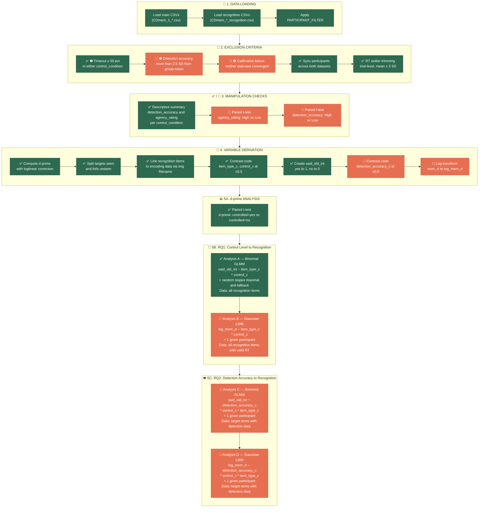

# SoA Behavioral Analyses — Step-by-Step Guide

This document explains what `beh_analyses_1.py` does and what still needs to be added. Nodes in **green (✅)** are already implemented; nodes in **orange (🔲)** still need to be coded.

---

## Pipeline Flowchart

---

## Section-by-Section Explanation

### 1. Data Loading

The script loads two types of CSV files from `DATA_DIR`:

| File type | Glob pattern | Contents |
|---|---|---|
| **Main data** | `CDmem_1_*.csv` | Encoding phase: trials, control conditions, agency ratings, detection accuracy |
| **Recognition data** | `CDmem_*_recognition.csv` | Memory test: `mem_response` (yes/no), `mem_rt`, `mem_ground_truth` (seen/unseen) |

Only participants listed in `PARTICIPANT_FILTER` are kept. Set it to `[]` to include everyone.

---

### 2. Exclusion Criteria

#### ✅ ❶ Timeout Rate (≥ 50%) — *implemented*
If a participant timed out on ≥ 50% of trials in either `control_condition` (high or low) during the test phase → **excluded**. Uses `TIMEOUT_THRESHOLD = 0.50`.

#### 🔲 ❷ Accuracy Outliers (> 2.5 SD) — *to add*
Compute each participant's mean `detection_accuracy` per condition. If it falls more than 2.5 SD from the group mean → **exclude**.

#### 🔲 ❸ Calibration Failure — *to add*
If neither QUEST+ staircase converged (final posterior SD ≥ 0.20) → **exclude**.

#### ✅ Participant Synchronization — *implemented*
After exclusions, ensure both datasets contain exactly the same participants via `valid_participants`.

#### ✅ RT Outlier Trimming — *implemented*
Trial-level: remove recognition trials where `mem_rt` exceeds `participant mean ± 3 × SD`.

---

### 3. Manipulation Checks

#### ✅ Descriptive Summary — *implemented*
Prints group means of `detection_accuracy` and `agency_rating` per `control_condition` (high vs low).

#### 🔲 Paired t-tests — *to add*
Run `pg.ttest(..., paired=True)` on participant-level means:
- **Agency rating:** High vs Low → expect High > Low
- **Detection accuracy:** High vs Low → expect High > Low

---

### 4. Variable Derivation

#### ✅ Already implemented:

| Variable | How it's made | Used in |
|---|---|---|
| `d_prime` | Loglinear correction: `norm.ppf(hit_rate) − norm.ppf(fa_rate)` | 5A t-test |
| `targets` | `recog_data[mem_ground_truth == 'seen']` | All models |
| `foils` | `recog_data[mem_ground_truth == 'unseen']`, dummy-coded 50/50 high/low | Analysis A, B |
| `item_type_c` | seen = +0.5, unseen = −0.5 | Analysis A, B, C, D |
| `control_c` | high = +0.5, low = −0.5 | Analysis A, B, C, D |
| `said_old_int` | `mem_response` yes → 1, no → 0 | Analysis A, C |

#### 🔲 To add:

| Variable | How to make it | Used in |
|---|---|---|
| `detection_accuracy_c` | correct (1) = +0.5, incorrect (0) = −0.5 | Analysis C, D |
| `log_mem_rt` | `np.log(mem_rt)` | Analysis B, D |

> [!IMPORTANT]
> When merging recognition items to encoding data (Step 2c in the script), you must also pull `detection_accuracy` into the lookup table — currently only `control_condition` is merged.

---

### 5. Statistical Analyses

#### 5A. d′ Analysis ✅ — *implemented*

**Paired t-test** comparing d′ for `controlled = yes` vs `controlled = no`.

Uses `pg.ttest(wide_dprime["yes"], wide_dprime["no"], paired=True)`.

---

#### 5B. RQ1 — Does Control Level Affect Recognition?

##### ✅ Analysis A — Binomial GLMM (already implemented)

| | |
|---|---|
| **DV** | `said_old_int` (0/1) |
| **Data** | All recognition items (targets + foils with dummy control) |
| **Maximal formula** | `said_old_int ~ item_type_c * control_c + (1 + item_type_c * control_c \| participant)` |
| **Fallback formula** | `said_old_int ~ item_type_c * control_c + (1 \| participant)` |
| **Family** | `binomial` |

##### 🔲 Analysis B — Gaussian LMM (to add)

| | |
|---|---|
| **DV** | `log_mem_rt` |
| **Data** | All recognition items with valid RT |
| **Formula** | `log_mem_rt ~ item_type_c * control_c + (1 \| participant)` |
| **Family** | Gaussian (default LMM) |

> [!NOTE]
> This is the **reaction time counterpart** of Analysis A. Use `lmer` instead of `glmer`. No maximal model needed.

---

#### 5C. RQ2 — Does Detection Accuracy Affect Recognition?

##### 🔲 Analysis C — Binomial GLMM (to add)

| | |
|---|---|
| **DV** | `said_old_int` (0/1) |
| **Data** | Target items (seen) that have valid `detection_accuracy` |
| **Formula** | `said_old_int ~ detection_accuracy_c * control_c * item_type_c + (1 \| participant)` |
| **Family** | `binomial` |

##### 🔲 Analysis D — Gaussian LMM (to add)

| | |
|---|---|
| **DV** | `log_mem_rt` |
| **Data** | Target items (seen) with valid `detection_accuracy` and valid RT |
| **Formula** | `log_mem_rt ~ detection_accuracy_c * control_c * item_type_c + (1 \| participant)` |
| **Family** | Gaussian (default LMM) |

> [!NOTE]
> These are **three-way interaction models**. The `*` operator expands to all main effects, two-way interactions, and the three-way interaction. No maximal models needed — use random-intercepts only.

---

## Quick Reference

| Label | Status | RQ | Model Type | DV | Key Predictors | Data Subset |
|---|---|---|---|---|---|---|
| **d′ t-test** | ✅ | — | Paired t-test | d′ | controlled (yes/no) | Participant-level summaries |
| **A** | ✅ | RQ1 | Binomial GLMM | `said_old_int` | `item_type_c × control_c` | All items (targets + foils) |
| **B** | 🔲 | RQ1 | Gaussian LMM | `log_mem_rt` | `item_type_c × control_c` | All items, valid RT |
| **C** | 🔲 | RQ2 | Binomial GLMM | `said_old_int` | `detection_accuracy_c × control_c × item_type_c` | Targets with detection data |
| **D** | 🔲 | RQ2 | Gaussian LMM | `log_mem_rt` | `detection_accuracy_c × control_c × item_type_c` | Targets with detection data, valid RT |
